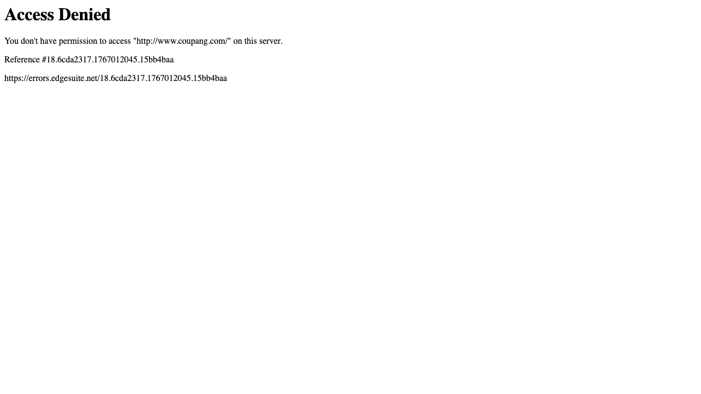

# QA Automation Lab · Public Web & CDN Monitoring (Coupang example)


Python + pytest + Playwright로 공개 웹/정적 리소스를 빠르게 검증하고, Positive/Negative/Regression/보안 행위 테스트를 한 번에 자동화하는 포트폴리오 프로젝트입니다. 예시 타깃으로 Coupang의 공개 리소스를 사용하지만, 구조는 어떤 퍼블릭 도메인에도 재활용 가능합니다.

## Highlights
- 공통 `ApiClient` + 환경변수(`QA_LAB_*`) 기반으로 BASE URL/CDN/timeout/User-Agent를 손쉽게 교체합니다.
- `pytest` 마커로 네트워크·UI·보안 테스트를 분리해 opt-in 실행이 가능합니다(`-m network`, `-m "network and ui"` 등).
- Threat Hunting 자료를 MITRE ATT&CK T1046(Discovery: Network Service Discovery) / T1190(Initial Access: public-facing abuse simulation, defensive) / T1595(Reconnaissance) / T1499(Impact) 로 매핑한 방어 목적 탐지 룰과 Negative 케이스를 포함합니다.
- Playwright(Chromium)로 Access Denied/SQLi 차단 화면을 실제 브라우저에서 캡처해 `reports/screenshots/` 에 증거를 남깁니다.
- GitHub Actions(`.github/workflows/qa.yml`)에서 `./scripts/run_tests.sh --report` 를 실행하고 HTML 리포트를 artifact로 업로드합니다.

## Quickstart
```bash
python3 -m venv .venv && source .venv/bin/activate
pip install -r requirements.txt && python -m playwright install chromium
# 기본(빠른 실행, 네트워크 제외)
./scripts/run_tests.sh -m "not network"
# (선택) HTML 리포트 생성
./scripts/run_tests.sh --report
```
- UI만 확인하고 싶다면 `pytest -m "network and ui"` 를 실행합니다.
- `--report` 옵션은 리포트 생성 플래그이며, 네트워크 포함 여부는 `-m` 옵션으로 결정됩니다.

## Test Coverage
- **Positive**: CDN 로고 자산 200 응답, `Content-Length`, HSTS, 정적 헤더 회귀(`tests/api/test_coupang_public.py`, `tests/api/test_coupang_assets.py`)
- **Negative**: SQLi 스타일 의심 검색 → 403 + `X-Reference-Error`, 위조 쿠키 주입, `/np/coupons` 접근 제한 (`tests/security/test_coupang_waf.py`, `tests/security/test_cookie_tampering.py`, `tests/api/test_coupang_product.py`)
- **Regression**: 홈/검색 응답의 HSTS·세션 헤더, 상태코드 일관성 (`tests/api/test_coupang_headers.py`)
- **Security Behaviors (MITRE)**:
  - T1046 Discovery – 짧은 시간 `/np/search` 반복 호출 탐지
  - T1190 Initial Access – 의심 검색 쿼리 패턴(방어 목적) 탐지
  - T1595 Recon – 제한 엔드포인트 접근 시 차단 여부
  - T1499 Impact – Latency spike 알람
  (`tests/security/test_mitre_behaviors.py`, `tests/security/test_abuse.py`, `qa_lab/utils/detections.py`)
- **Logs & Reporting**: `QA_LAB_LOG_PATH` 지정 시 HTTP 로그를 JSON 라인으로 저장하고 pytest로 검증 (`tests/security/test_log_sink.py`)
- **UI (Playwright)**: Access Denied 배너, SQLi 차단 페이지, 스크린샷 저장 (`tests/ui/test_coupang_ui.py`)

## Markers & Execution
| 마커 | 설명 | 예시 명령 |
| --- | --- | --- |
| `network` | 실서비스 호출(HTTP/Playwright) | `pytest -m network` |
| `ui` | Playwright UI 테스트 | `pytest -m "network and ui"` |
| `slow` | Rate-limit 의존 테스트 | `pytest -m slow` |
| 없음 | mock/fake response 기반 빠른 테스트 | `pytest -m "not network"` |

`./scripts/run_tests.sh --report` 는 내부적으로 `reports/qa_report_<timestamp>.html` 과 스크린샷을 생성합니다.

## Environment Variables
| 변수 | 기본값 | 설명 |
| --- | --- | --- |
| `QA_LAB_BASE_URL` | `https://www.coupang.com` | 메인 도메인 (API 테스트) |
| `QA_LAB_CDN_URL` | `https://static.coupangcdn.com` | 정적 자산 검증용 |
| `QA_LAB_TIMEOUT` | `5` | `requests` 타임아웃(초) |
| `QA_LAB_USER_AGENT` | `QA-Automation-Lab/0.1 (+pytest requests)` | 공통 User-Agent |
| `QA_LAB_LOG_PATH` | (빈 값) | 설정 시 HTTP 로그를 JSON 라인 파일로 저장 |

## CI & Reports
- `.github/workflows/qa.yml` 은 Ubuntu + Python 3.11 + Playwright 환경을 세팅하고, 전체 테스트 실행 후 HTML 리포트를 artifact 로 업로드합니다.
- 로컬에서도 동일 명령(`./scripts/run_tests.sh --report`)만 실행하면 타임스탬프 기반 HTML 리포트가 `reports/` 아래에 누적됩니다.

## Samples
- [HTML Report (mock run)](docs/samples/qa_report_sample.html)
- Access Denied 화면 (Playwright 캡처)



## Safety / Ethics
본 프로젝트는 학습/포트폴리오 목적이며, **테스트 트래픽을 최소화하고 민감 페이로드를 과도하게 보내지 않습니다.** 실 서비스에 보내는 호출도 1~2회 수준으로 한정하고, 호출 간 0.2초 이상의 딜레이를 두어 WAF나 서비스에 부담을 주지 않도록 합니다.  
네트워크 테스트는 opt-in(`-m network`)일 때만 수행되며, 기본 실행은 mock/monkeypatch 응답으로만 돌아갑니다. 실서비스 도메인을 교체할 때도 동일한 원칙을 적용합니다.

## Repo Layout
```text
qa-automation-lab/
  qa_lab/            # 공통 코드 (config/client/utils)
  tests/
    api/             # Positive/Regression
    security/        # Negative/MITRE/로그
    ui/              # Playwright
  docs/              # 시나리오·결정·결과·setup
  scripts/run_tests.sh
  reports/
    qa_report_*.html
    screenshots/     # Playwright 스크린샷 아웃풋
  .github/workflows/qa.yml
```

## Roadmap
- 실제 검색 성공 플로우(로그인/세션 환경) 확보 시 Positive 테스트를 확장합니다.
- CDN 외 CSS/JS sprite 회귀 모니터링을 추가합니다.
- HTML 리포트 샘플을 README에 링크하거나 스크린샷을 첨부합니다.
- `QA_LAB_LOG_PATH` 로그 기반으로 탐지 결과/alert 를 자동 분석하는 리포트를 추가합니다.
